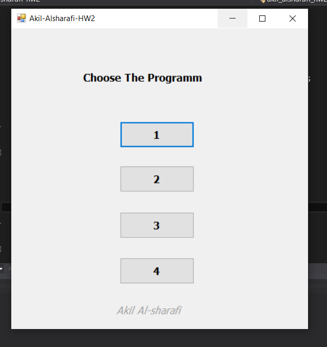
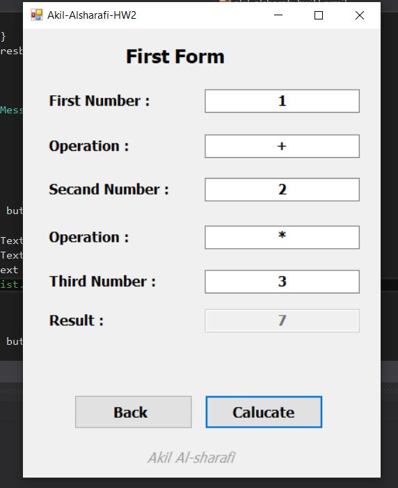
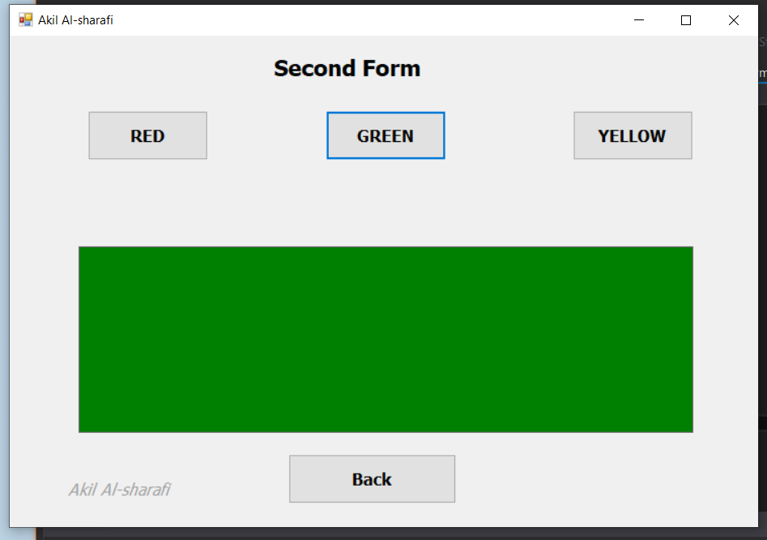
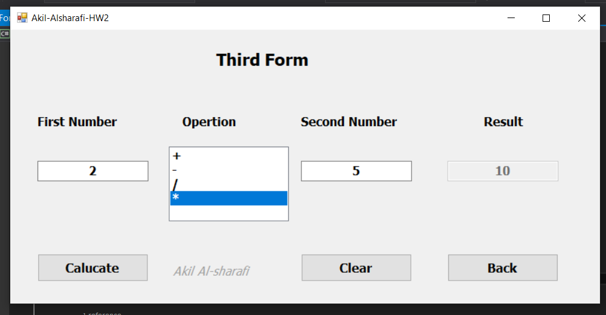
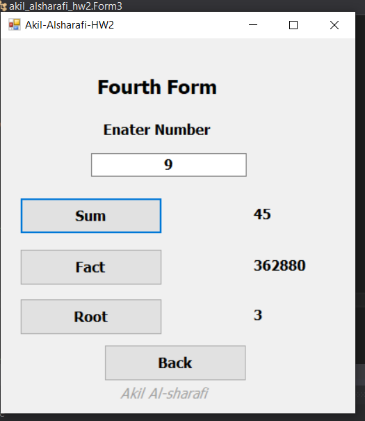

# واجب مادة البرمجة المرئية 
## واجب رقم 2

### الطالب: عقيل عبده محمد عقيل الشرفي  
### الجامعة: جامعة إب  
### الكلية: كلية العلوم  
### المستوى: الثالث  

---

##
## الصور المرفقة:

1. 
2. 
3. 
4. 
5. 
